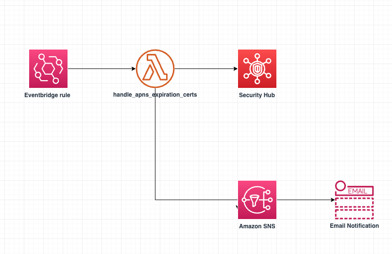

# Amazon SNS APNS Certificate Expiration Notifier

In this solution, we’ll discuss how we can monitor the expiration dates of APNS certificates in Amazon SNS and implement a monitoring system around the expiration dates of certificates so that we can prevent an operational incident.

Amazon SNS supports two methods for authenticating with iOS mobile push endpoints when sending a mobile push notification via the APNs:

*	Certificate-based authentication
*	Token-based authentication

To use certificate-based authentication, you must configure Amazon SNS with a provider certificate. Amazon SNS will use this certificate on your behalf to establish a secure connection with the APNs to dispatch your mobile push notifications. For each application that you support, you will need to provide unique certificates.The certificate is used to establish a secure connection between your provider server and APNs. This certificate is obtained from Apple through an App store developer account. This certificates expire after one year. If an APN certificate expires, the ability to send push notifications to your app will be impaired. For more information, see [Establishing a Certificate-Based Connection to APNs](https://developer.apple.com/documentation/usernotifications/setting_up_a_remote_notification_server/establishing_a_certificate-based_connection_to_apns) on the Apple Developer website.

Important: this application uses various AWS services and there are costs associated with these services after the Free Tier usage - please see the [AWS Pricing page](https://aws.amazon.com/pricing/) for details. You are responsible for any AWS costs incurred. No warranty is implied in this example.

### Requirements

* [Create an AWS account](https://portal.aws.amazon.com/gp/aws/developer/registration/index.html) if you do not already have one and log in. The IAM user that you use must have sufficient permissions to make necessary AWS service calls and manage AWS resources.
* [AWS CLI](https://docs.aws.amazon.com/cli/latest/userguide/install-cliv2.html) installed and configured
* [Git Installed](https://git-scm.com/book/en/v2/Getting-Started-Installing-Git)
* [AWS Cloud Development Kit](https://docs.aws.amazon.com/cdk/v2/guide/getting_started.html) installed

### Getting Started
The entire solution is built on CDK and Lambda function in python 3.9 runtime. The instructions below shows the prerequisities and deployment instructions.

### Architecture Diagram


### Prerequisites

* [Apple Push Notification Service (APNS) certificate](https://developer.apple.com/documentation/usernotifications/setting_up_a_remote_notification_server/establishing_a_certificate-based_connection_to_apns)

For more information, see [Prerequisites for Amazon SNS user notifications](https://docs.aws.amazon.com/sns/latest/dg/sns-prerequisites-for-mobile-push-notifications.html) and [Apple authentication methods](https://docs.aws.amazon.com/sns/latest/dg/sns-apple-authentication-methods.html) in the Amazon SNS Developer Guide.

### Deployment Instructions

1. Create a new directory, navigate to that directory in a terminal and clone the GitHub repository:
    ``` 
    git clone https://github.com/aws-samples/amazon-sns-apns-certificate-expiration-notifier
    ```
2. Change directory to the pattern directory:
    ```
    cd amazon-sns-apns-certificate-expiration-notifier
    ```
3. Configure the Amazon SNS Topic name and provide the email address to get notified from this solution:

    * Open cdk.json file and edit SNS_TOPIC_ARN & NOTIFY_EMAIL_ADDRESS. (By default this solution will send notification before 15 days of APNS certificate expiration. If you need to modify this configuration please change CERT_EXPIRY_DAYS as needed)

4. Create a virtualenv on MacOS and Linux 
    ``` 
    python3 -m venv .venv
    ```
5. After the init process completes and the virtualenv is created, you can use the following step to activate your virtualenv
    ```
    source .venv/bin/activate
    ```
6. If you are a Windows platform, you would activate the virtualenv with below command

    ```
    .venv\Scripts\activate.bat
    ```
7. Once the virtualenv is activated, you can install the required dependencies  
    ``` 
    pip install -r requirements.txt
    ```
8. Synthesize the CloudFormation template for this code 
    ```
    cdk synth
    ```
9. Deploy the stack

    ```
    cdk deploy
    ```

### How it works

1.	An  Eventbridge rule runs a cronjob that invokes a Lambda function.
2.	The Lambda function calls the ListPlatformApplications API on SNS to return a list of APNS applications along with the certificate expiration dates.
3.	The Lambda then checks if the expiration date is within a set threshold number of days from the current date.
4.	For the certificates within the expiration threshold, it logs the information into AWS Security Hub (if enabled).
5.	The Lambda also publishes to an SNS topic which will then send notifications to any subscribers of the SNS topic.

### Cleanup
 
1. To cleanup/delete resources created while deploying the solution, go to the root folder of the project repository and run 
    ```
    cdk destroy
    ```
### Useful commands

 * `cdk ls`          list all stacks in the app
 * `cdk synth`       emits the synthesized CloudFormation template
 * `cdk deploy`      deploy this stack to your default AWS account/region
 * `cdk diff`        compare deployed stack with current state
 * `cdk docs`        open CDK documentation
----
Copyright 2023 Amazon.com, Inc. or its affiliates. All Rights Reserved.

SPDX-License-Identifier: MIT-0